# EasyLearn V2 — End-to-End Architecture & Strategy

> **Version:** 2.0  
> **Status:** Architecture / Product Baseline  
> **Date:** August 2026  
> **Product:** EasyLearn — Personal Knowledge & Learning Platform

---

## 1. Executive Summary

EasyLearn V2 evolves the existing LLM-based learning chatbot into a **personal knowledge and learning platform**.

The current EasyLearn concept allows a learner to enter a topic and receive study notes at three levels:

1. **Short** — simplified notes for quick understanding.
2. **Descriptive** — step-by-step reasoning for better clarity.
3. **Detailed** — in-depth content for advanced learners.

V2 keeps this learning experience but changes the knowledge foundation.

Instead of relying primarily on the LLM's internal knowledge, EasyLearn will:

> **Retrieve the right knowledge first, then use a good-enough LLM to explain that knowledge well.**

The platform will allow authenticated users to bring their own documents and selected web resources, combine them with a curated and demand-driven global knowledge layer, retrieve relevant evidence, and turn that evidence into grounded explanations, structured notes, and visual learning artifacts.

The major design goals are:

- Resource efficiency
- Low latency
- Privacy-aware user knowledge isolation
- Grounded answers
- Good retrieval quality
- Good-enough generation models instead of SOTA LLMs
- Cheap and efficient embeddings for persistent knowledge indexing
- Modular architecture
- Modern and user-friendly frontend

---

# 2. Existing EasyLearn Baseline

The existing EasyLearn project is an LLM-based chatbot intended to help learners understand topics at different depths of understanding.

The current project uses:

- **Backend:** Python, LangChain, FastAPI, Pydantic, Uvicorn
- **Frontend:** ReactJS, HTML, CSS, JavaScript

The existing learning model is based around:

```text
Topic
  ↓
LLM
  ↓
┌────────────┬──────────────┬──────────────┐
│   Short    │ Descriptive  │   Detailed   │
└────────────┴──────────────┴──────────────┘
```

V2 retains this learning model but introduces a knowledge/retrieval architecture underneath it.

---

# 3. V2 Product Vision

EasyLearn V2 should be thought of as:

> **A personal knowledge system with RAG as its retrieval layer.**

RAG is not the entire product. It is the mechanism that connects the learner's knowledge sources to the learning experience.

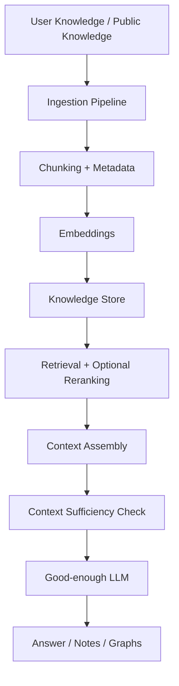

The product therefore becomes broader than a normal RAG chatbot.

---

# 4. Core Product Principle

The central engineering principle for V2 is:

> **EasyLearn should retrieve the right knowledge first; the LLM should primarily be responsible for explaining it well.**

This principle drives almost every architectural decision:

```text
Strong Retrieval
       +
Good Context Construction
       +
Good Prompting
       +
Good-enough LLM
       =
Efficient Grounded Learning System
```

Instead of:

```text
Poor Retrieval
      +
Huge LLM
      =
Expensive / Less Predictable System
```

---

# 5. V2 Goals

EasyLearn V2 will aim to:

- Allow users to upload PDF, DOCX, TXT and Markdown documents.
- Allow users to provide URLs as knowledge sources.
- Scrape and process web content.
- Provide a specialized web-search capability for discovering relevant online sources.
- Maintain separate **Private/User** and **Global** knowledge scopes.
- Ensure private content is visible only to its owner.
- Reuse high-quality public knowledge efficiently through a curated global knowledge cache.
- Keep one-off web search results temporary by default.
- Expire inactive global knowledge after a configurable TTL (initial target: 30 days) and rehydrate it from the web when needed.
- Retrieve relevant context before generation.
- Prevent unsupported out-of-context answers.
- Use good-enough text-generation LLMs instead of SOTA models.
- Select an embedding model based on quality, efficiency and cost for persistent knowledge indexing.
- Preserve Short / Descriptive / Detailed learning modes.
- Generate structured notes.
- Allow notes to be downloaded as MD, TXT and DOCX.
- Generate Mermaid-based diagrams.
- Optionally retrieve relevant Internet images.
- Provide a dashboard for managing personal knowledge.
- Provide a dashboard for saved notes.
- Provide a modern, slick and user-friendly frontend.

---

# 6. V2 Non-Goals

The initial V2 should **not** attempt to:

- Build a frontier/SOTA foundation model.
- Make the LLM the primary retrieval mechanism.
- Automatically publish every user URL or web-search result into the global store.
- Treat the Global Knowledge Cache as a permanent archive of everything ever retrieved.
- Treat prompt instructions alone as a sufficient security or grounding mechanism.
- Build every advanced learning feature immediately.
- Prematurely split the application into many microservices.
- Optimize for massive scale before correctness and retrieval quality are validated.

---

# 7. High-Level Architecture

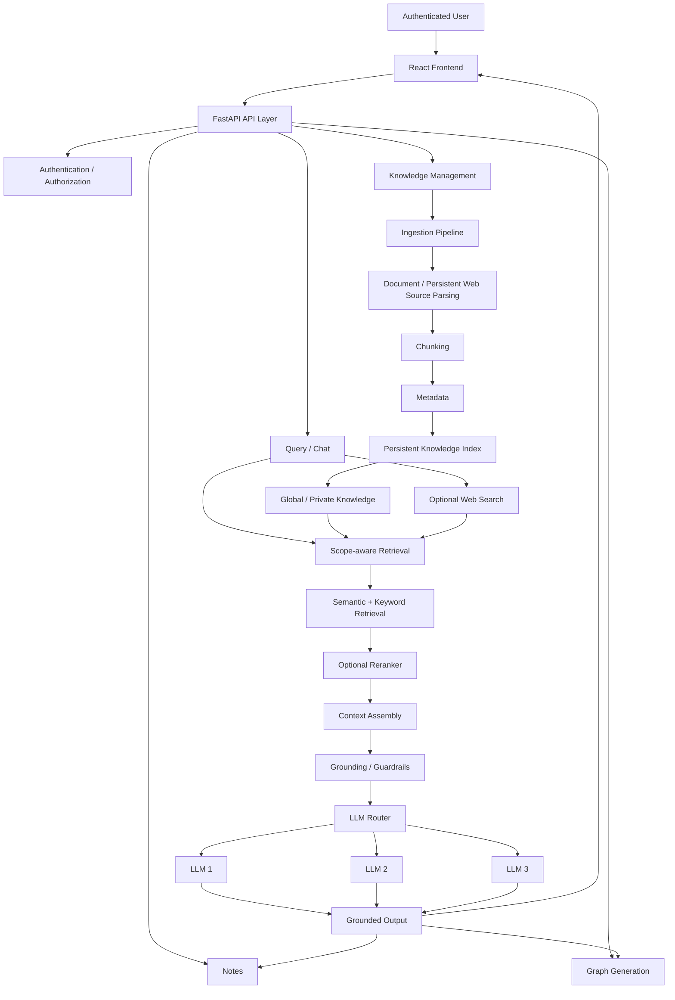

---

# 8. Knowledge Source Strategy

EasyLearn V2 supports three knowledge acquisition paths:

1. **Local documents** — persistent private knowledge.
2. **User-provided URLs** — persistent private knowledge by default.
3. **Web search / top-K online sources** — temporary context by default, with explicit/curated persistence when appropriate.

## 8.1 Local Documents

Initial supported formats:

- PDF
- DOCX
- TXT
- MD

Processing pipeline:

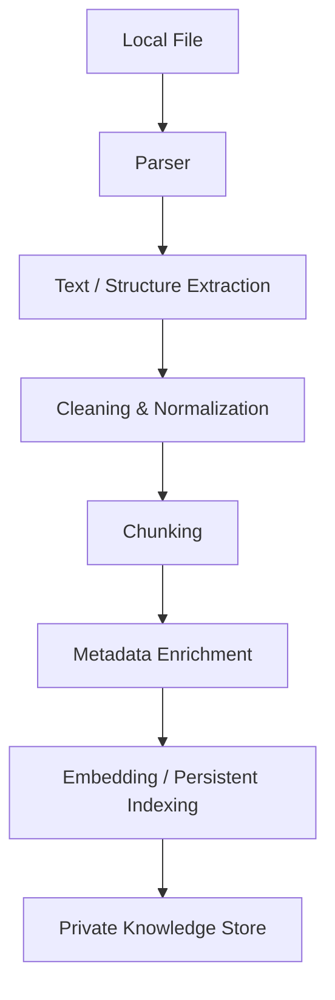

Important metadata includes:

- `document_id`
- `chunk_id`
- `owner_id`
- `scope`
- filename
- source type
- page number where available
- section / heading where available
- creation / ingestion timestamp
- content hash / version identifier
- embedding model where embeddings are used

## 8.2 User-provided URLs

A user may provide a URL and explicitly add it to their personal knowledge.

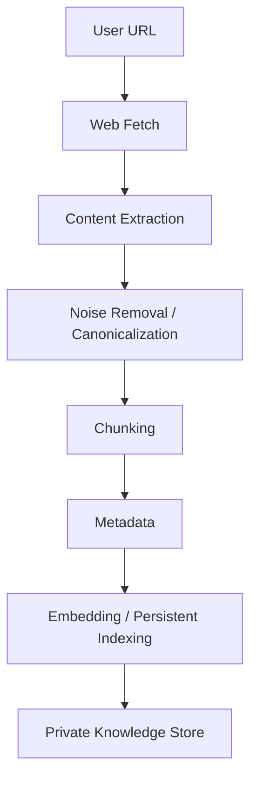

A user-provided URL is **private by default**, even when the underlying webpage is publicly accessible.

A later explicit action may submit a source for global curation, but the default path remains private.

## 8.3 Web Search / Top-K Online Sources

EasyLearn should provide a specialized capability for discovering relevant online information without requiring the user to provide a URL.

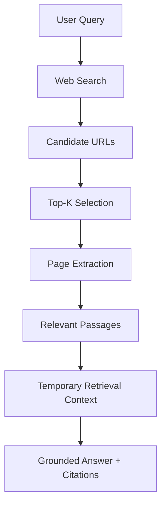

The important distinction is:

> **Web retrieval does not imply persistent embedding.**

One-off search results can remain temporary context. They only become persistent knowledge when explicitly saved privately or accepted into the Global Knowledge Cache through the eligibility process.

# 9. Knowledge Store Strategy

EasyLearn V2 has **two persistent knowledge scopes**:

1. **Private/User Knowledge** — persistent knowledge selected by an individual user.
2. **Global Knowledge Cache** — curated public knowledge that is reusable across users but expires when it is no longer used.

Web search is a separate **temporary retrieval path** and does not automatically become persistent knowledge.

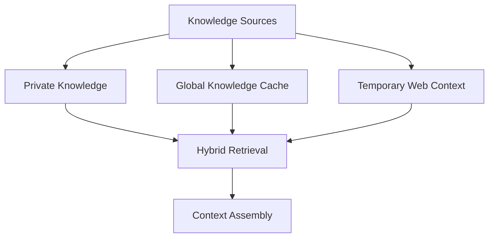

## 11.1 Private/User Knowledge

Private knowledge contains sources intentionally added by a user:

- Uploaded PDF/DOCX/TXT/MD files
- User-provided URLs
- User-selected web sources that they explicitly save

Private knowledge is persistent until the user deletes or manages it.

A public URL does **not** become global merely because it was added by a user. It remains private by default.

## 11.2 Global Knowledge Cache

The Global Store is **not a permanent dump of public Internet content**. It is a curated, reusable and demand-driven knowledge cache.

Global content should normally satisfy eligibility criteria such as:

- Reusable across many users
- High-quality and useful
- Preferably authoritative or clearly attributable
- Stable enough to justify persistent indexing
- Legally/operationally appropriate for the intended use
- Cleaned of irrelevant web/navigation noise

Public availability alone is **not** sufficient for global ingestion.

## 11.3 Temporary Web Retrieval

A web search request follows this path:

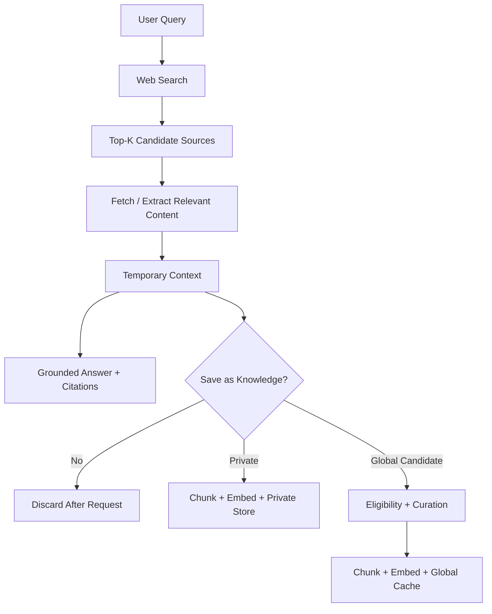

**Important:** one-off web retrieval does not require permanent embeddings. Embeddings are primarily used for **persistent knowledge that needs to be searched repeatedly**.

## 11.4 Global Eligibility / Curation

A public source can enter the Global Knowledge Cache only after passing the global eligibility process.

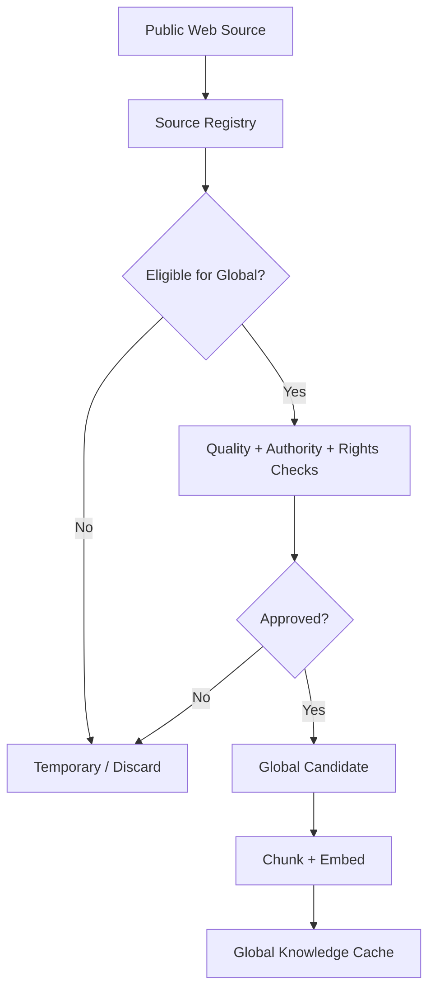

EasyLearn should not rely on an LLM alone to decide what becomes global knowledge. Deterministic metadata and policy checks should be used first, with model-based evaluation only as an optional signal.

## 11.5 Global Knowledge TTL

Global knowledge follows an **inactivity-based TTL** rather than a lifetime retention policy.

Initial strategy:

> **If a global source has not actually contributed to retrieval for 30 days, it becomes eligible for expiration.**

The TTL should be configurable. The initial target is 30 days.

Recommended metadata:

```json
{
  "source_id": "src_123",
  "scope": "global",
  "created_at": "2026-08-01T10:00:00Z",
  "last_accessed_at": "2026-08-15T14:32:00Z",
  "ttl_days": 30,
  "expires_at": "2026-09-14T14:32:00Z"
}
```

TTL should initially be tracked at the **source/document level**, rather than independently per chunk, so one article does not end up with fragmented lifecycle states.

A source's `last_accessed_at` should be refreshed when its content actually contributes to a retrieval result/context, not merely because it appeared as a weak candidate.

## 11.6 Global Rehydration

Expiration does not mean the source can never return. If a user asks for knowledge that has expired from the Global Cache:

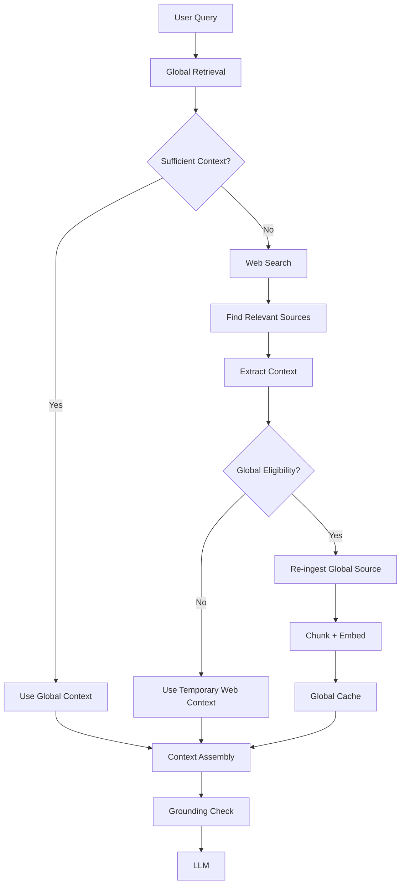

This makes the Global Store a **self-cleaning, demand-driven cache backed by web retrieval**, rather than a permanent archive.

# 10. Privacy and Scope Enforcement

Privacy must be enforced by the **backend and retrieval layer**, not just the frontend.

Every retrievable chunk should have a scope.

Example:

```json
{
  "chunk_id": "chunk_123",
  "document_id": "doc_456",
  "owner_id": "user_123",
  "scope": "private",
  "source_type": "pdf",
  "content": "..."
}
```

Global content:

```json
{
  "chunk_id": "chunk_789",
  "document_id": "doc_999",
  "owner_id": null,
  "scope": "global",
  "content": "..."
}
```

The conceptual retrieval condition is:

```text
scope == GLOBAL
OR
(scope == PRIVATE AND owner_id == current_user_id)
```

The system should **not**:

```text
Retrieve everything
      ↓
Filter afterward
```

Instead:

```text
Authenticated User
      ↓
Authorized Retrieval Scope
      ↓
Relevant Chunks
```

This prevents cross-user data leakage.

---

# 11. Authentication

Authentication is mandatory because EasyLearn V2 contains private user knowledge.

The system should require users to log in before accessing personal knowledge.

Every private-data operation should verify authorization:

- Read
- Upload
- Update
- Delete
- Reprocess
- Retrieve
- Export

The frontend should never be the only enforcement layer.

---

# 12. Ingestion Architecture

The ingestion pipeline should be independent from the LLM.

Uploading a document should not require repeated generation calls.

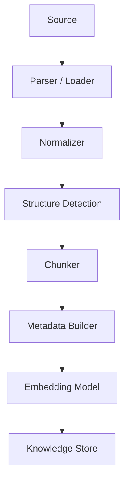

## Ingestion Principles

- Process each persistent source once.
- Reuse embeddings for persistent knowledge.
- Do not permanently embed one-off web-search results unless they are saved or approved for persistent knowledge.
- Avoid unnecessary LLM calls during ingestion.
- Use content hashes to detect duplicates.
- Keep ingestion asynchronous for large sources.
- Store processing status.
- Preserve source metadata.
- Allow failed sources to be reprocessed.

---

# 13. Chunking Strategy

Chunking should be **structure-aware** rather than blindly splitting every fixed number of characters.

The system should preserve:

- Headings
- Paragraphs
- Lists
- Tables where possible
- Page boundaries
- Section boundaries

Principles:

- Prefer semantic chunks.
- Use overlap only where useful.
- Avoid extremely large chunks.
- Avoid extremely small chunks.
- Preserve page/section metadata.
- Benchmark chunking against actual EasyLearn queries.

The final chunk size and overlap should be determined through experimentation rather than arbitrary convention.

---

# 14. Embedding Strategy

Embeddings are an **indexing mechanism for persistent knowledge**, not a requirement for every web-retrieved document. Their purpose is to make semantic retrieval efficient over knowledge that EasyLearn expects to search repeatedly.

The embedding model must be:

- Cheap
- Efficient
- Accurate enough
- Practical to deploy
- Fast enough for the expected ingestion/query workload

Evaluation criteria:

| Dimension                | Importance       |
| ------------------------ | ---------------- |
| Retrieval quality        | Very High        |
| Latency                  | High             |
| Memory usage             | High             |
| CPU/GPU requirement      | High             |
| Embedding dimensionality | Medium/High      |
| Storage cost             | Medium/High      |
| Multilingual support     | Depends on scope |
| License                  | High             |
| Deployment complexity    | High             |

The final embedding model should be selected through **EasyLearn-specific benchmarking**, not simply by choosing a model because it performs well on a general leaderboard.

---

# 15. Retrieval Strategy

Retrieval is the core of V2. Its job is to locate the smallest, most relevant evidence set that can support the user's request.

Embeddings are **not the same thing as the knowledge store**. They are an indexing mechanism used for persistent knowledge when semantic retrieval is useful.

EasyLearn should support a retrieval layer that can combine:

- Semantic/vector retrieval
- Keyword/BM25-style retrieval
- Metadata filtering
- Optional reranking

The initial baseline can begin with semantic retrieval for persistent indexed knowledge, while the architecture remains open to hybrid retrieval.

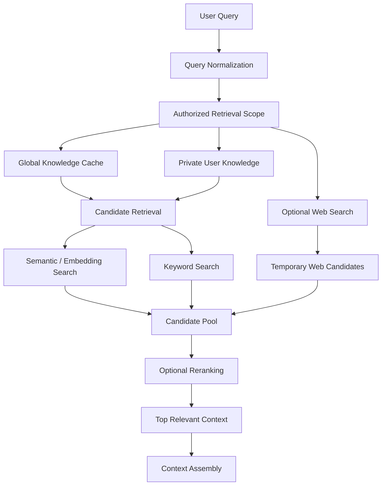

## 17.1 Persistent Knowledge vs Temporary Web Context

```text
Persistent knowledge
    → chunk
    → embed/index
    → store
    → retrieve repeatedly

One-off web retrieval
    → search
    → extract relevant passages
    → temporary context
    → answer + citations
    → discard unless explicitly saved/approved
```

This avoids spending embedding/storage resources on web content that may never be used again.

## 17.2 Retrieval Scope

The retriever must search only content the authenticated user is allowed to access:

```text
GLOBAL
OR
PRIVATE where owner_id == current_user_id
OR
Temporary web context returned for the current request
```

Authorization should be applied before or during retrieval, not by retrieving unrestricted content and filtering afterward.

## 17.3 Initial Retrieval Strategy

1. Apply authorization and metadata filters.
2. Retrieve candidates from persistent Global/Private knowledge.
3. Use semantic/vector retrieval as the initial baseline where embeddings exist.
4. Keep keyword/hybrid retrieval available as a complementary strategy.
5. Add web retrieval when persistent context is insufficient or the user explicitly requests fresh web information.
6. Optionally rerank candidates.
7. Deduplicate and assemble context.
8. Preserve citation metadata.

# 16. Reranking Strategy

Reranking is an optimization layer rather than a mandatory first component.

Initial:

```text
Query
 ↓
Vector Retrieval
 ↓
Top-K
```

Later:

```text
Query
 ↓
Vector Retrieval
 ↓
Candidate Set
 ↓
Reranker
 ↓
Top Relevant Chunks
```

The decision to add a reranker should be based on:

- Retrieval quality improvement
- Latency overhead
- Resource requirements

---

# 17. LLM Strategy

EasyLearn V2 intentionally does **not** depend on SOTA LLMs.

The system should use good-enough text-generation models whose main job is to transform retrieved context into clear and correct explanations.

Initial strategy:

> Evaluate three text-generation LLMs.

Conceptually:

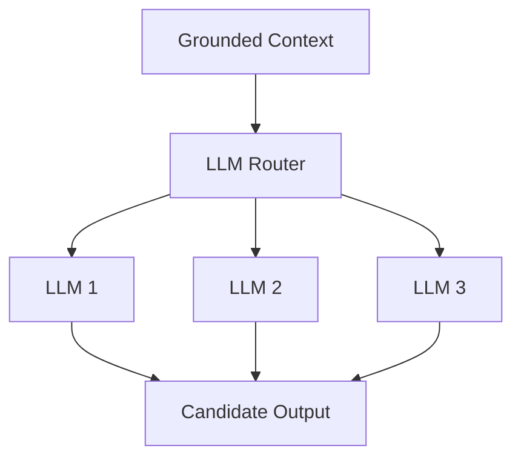

Evaluation criteria:

- Grounded answer quality
- Instruction following
- Hallucination rate
- Latency
- Memory requirements
- Cost
- Local/self-hosted feasibility

The generation layer should expose a common interface so the rest of the platform is not coupled to one model.

---

# 18. Core Guardrail Principle

The system must follow:

> **Do not give unsupported out-of-context answers.**

A prompt such as:

> "Only answer using the context."

is useful but is **not enough by itself**.

The architecture should include an explicit context sufficiency stage.

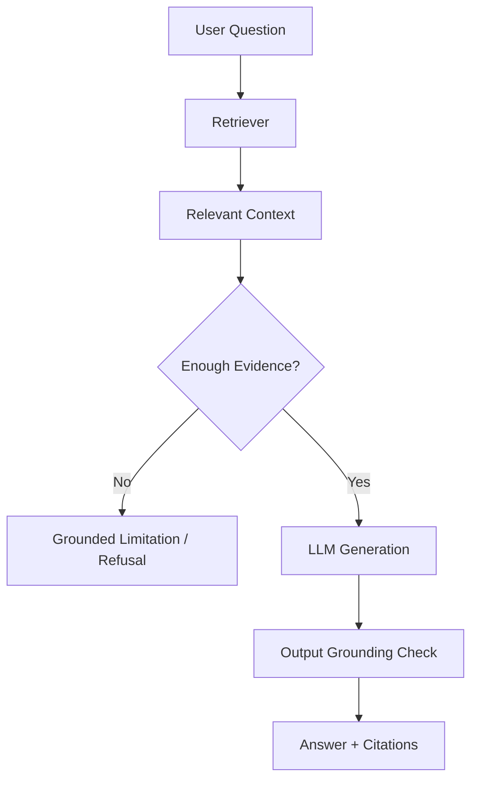

---

# 19. Grounding Strategy

The system should have two important checkpoints.

### Pre-generation

Determine whether enough relevant evidence exists.

```text
Retrieval
   ↓
Evidence Sufficiency
   ↓
Enough? ── No → Grounded limitation
   │
  Yes
   ↓
LLM
```

### Post-generation

Where practical, validate whether generated claims are supported by retrieved context.

Potential signals:

- Retrieval relevance
- Citation coverage
- Claim/evidence alignment
- Unsupported statement detection

The exact validator can evolve over time.

---

# 20. Citations

Citations should be designed into the system from the beginning.

For a PDF:

```text
Source: transformers.pdf
Page: 17
Section: Self Attention
```

For a web source:

```text
Source: example.com/article
```

The metadata attached to chunks should survive:

```text
Source
 ↓
Chunk
 ↓
Embedding
 ↓
Retrieval
 ↓
Context
 ↓
LLM
 ↓
Citation
```

This makes answers more trustworthy and allows users to inspect the evidence behind an explanation.

---

# 21. Complete Query-Time Pipeline

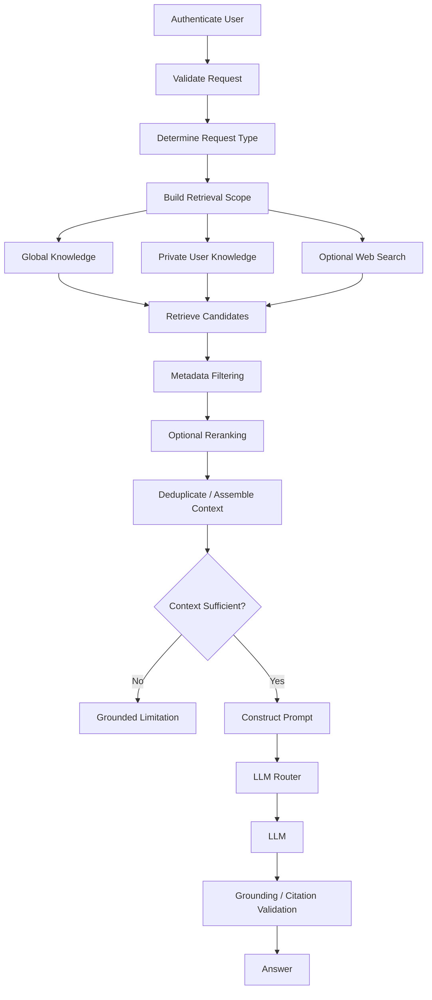

---

# 22. Notes Generation

Notes remain a core EasyLearn feature.

The existing three-level model becomes grounded in retrieved knowledge.

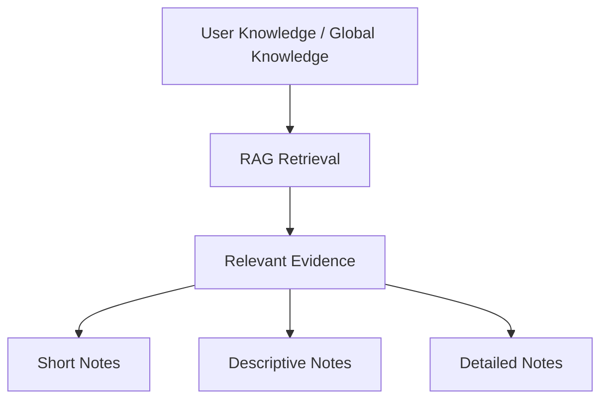

## Short

Purpose:

> Quick understanding.

Typical output:

- Definitions
- Key points
- Concise explanations

## Descriptive

Purpose:

> Better conceptual clarity.

Typical output:

- Step-by-step explanation
- Examples
- Relationships between concepts

## Detailed

Purpose:

> Deep study.

Typical output:

- Expanded explanation
- Examples
- Important caveats
- Citations
- Detailed relationships

The notes must be generated from retrieved context rather than being unconstrained LLM output.

---

# 23. Notes Export

Generated notes should be available as:

```text
Markdown
   ↓
TXT
   ↓
DOCX
```

The user should be able to:

- Save notes
- View notes
- Download notes
- Delete notes

The notes dashboard should preserve the relationship between a note and its underlying knowledge sources.

---

# 24. Notes Dashboard

The Notes dashboard should feel more like a personal knowledge/blog system.

Example:

```text
My Notes

┌──────────────────────────────────────┐
│ Understanding Transformers           │
│ Detailed • 8 min read                │
│ August 16, 2026                      │
└──────────────────────────────────────┘

┌──────────────────────────────────────┐
│ RAG Architecture                     │
│ Descriptive • 5 min read             │
│ August 15, 2026                      │
└──────────────────────────────────────┘
```

Possible features:

- Title
- Learning level
- Creation date
- Sources
- Read
- Edit metadata
- Export
- Delete

---

# 25. Graph / Diagram Generation

EasyLearn should support visual learning.

The LLM should **not directly generate arbitrary SVG graphics**.

Instead:

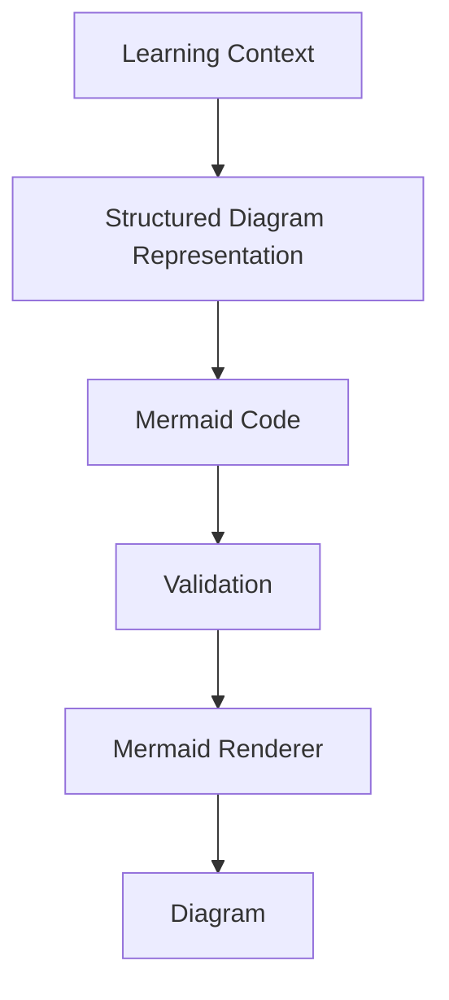

Potential diagrams:

- Flow diagrams
- User-flow diagrams
- Process diagrams
- Decision flows
- Architecture diagrams
- Relationship diagrams where Mermaid is appropriate

Mermaid becomes the intermediate representation.

Example:

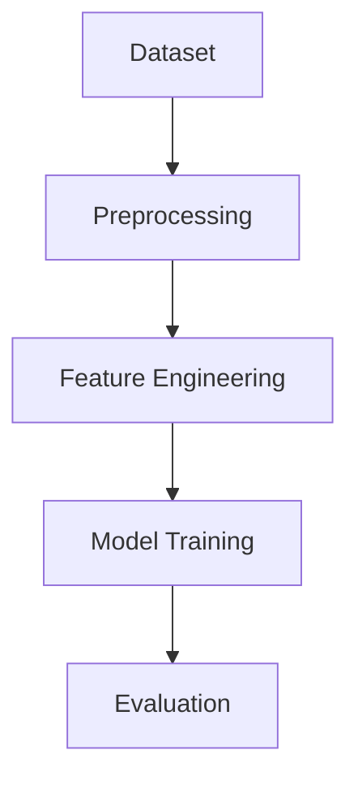

The system can support colors and styling through the selected Mermaid rendering approach, subject to renderer/version support.

---

# 26. Tabular Information

Not every visual should become a graph.

If the retrieved information naturally forms a table, EasyLearn should generate a table.

Example:

| Concept   | Purpose                  | Example            |
| --------- | ------------------------ | ------------------ |
| Embedding | Numerical representation | Sentence vector    |
| Retrieval | Find relevant context    | Top-K chunks       |
| Reranking | Improve relevance        | Candidate ordering |

The generation system should select the most appropriate representation:

```text
Structured Information
        ↓
 ┌──────┼────────┐
 ↓      ↓        ↓
Table  Mermaid  Text
```

---

# 27. Internet Image Retrieval

Image retrieval is an optional enrichment feature rather than a core RAG dependency.

Potential pipeline:

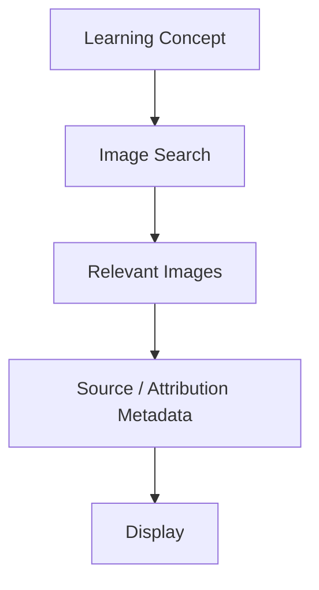

Important considerations:

- Source URL
- Attribution
- Licensing/reuse restrictions
- Relevance
- Image quality

The system should not assume that every Internet image is freely reusable.

---

# 28. Knowledge Dashboard

The user should have a local/private knowledge management dashboard.

Example:

```text
My Knowledge

📄 Machine Learning.pdf
   124 chunks
   Added: Aug 16

📄 Transformers.md
   42 chunks
   Added: Aug 15

🌐 PyTorch Documentation
   87 chunks
   Added: Aug 15
```

Possible actions:

- Open
- Rename
- Delete
- Reprocess
- View source
- View processing status
- Optional publish-to-global action

Useful metrics:

- Number of documents
- Number of URLs
- Number of indexed chunks
- Storage usage
- Processing failures

---

# 29. Frontend Strategy

The frontend should remain modern, slick, and user-friendly.

Suggested major areas:

```text
EasyLearn
│
├── Home / Chat
├── Add Knowledge
├── My Knowledge
├── My Notes
├── Models / Settings
└── Source / Citation Viewer
```

The user should easily understand:

- What knowledge is being used.
- Whether the source is private or global.
- Where an answer came from.
- Whether the system has enough context.
- Which learning level is being generated.

---

# 30. Backend Strategy

FastAPI remains a suitable backend foundation.

Suggested logical modules:

```text
backend/
│
├── auth/
├── users/
├── knowledge/
├── ingestion/
├── documents/
├── web/
├── embeddings/
├── retrieval/
├── reranking/
├── grounding/
├── llm/
├── chat/
├── notes/
├── graphs/
├── exports/
└── dashboard/
```

These should initially remain modular components inside a manageable backend rather than immediately becoming independently deployed microservices.

---

# 31. Data Architecture

A practical V2 architecture separates application metadata from vectorized content.

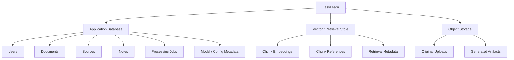

The exact database, vector store and object-storage technologies remain implementation decisions.

---

# 32. Suggested Knowledge Object

A retrievable chunk should conceptually look like:

```json
{
  "chunk_id": "chunk_123",
  "document_id": "doc_456",
  "owner_id": "user_123",
  "scope": "private",
  "source_type": "pdf",
  "source_uri": "...",
  "filename": "transformers.pdf",
  "page": 17,
  "section": "Self Attention",
  "content_hash": "...",
  "created_at": "...",
  "embedding_model": "...",
  "last_accessed_at": "...",
  "ttl_days": 30,
  "expires_at": "..."
}
```

This provides enough metadata for:

- Authorization
- Retrieval
- Citation
- Reprocessing
- Debugging
- Lifecycle management

---

# 33. Performance & Resource Efficiency

Resource efficiency is a first-class design goal.

The system should:

- Embed persistent knowledge once and reuse embeddings.
- Do not permanently embed one-off web-search results unless they are saved or approved for persistent knowledge.
- Reuse embeddings.
- Use content hashes to detect duplicates.
- Avoid unnecessary LLM calls.
- Use top-K context instead of whole documents.
- Cache stable results where safe.
- Cache web content where appropriate.
- Stream LLM responses.
- Process ingestion asynchronously.
- Keep generation models reasonably small.
- Measure retrieval and generation latency separately.

The goal is not just model inference speed.

The target is:

> **Low end-to-end user-perceived latency.**

---

# 34. Caching Strategy

Potential caching layers:

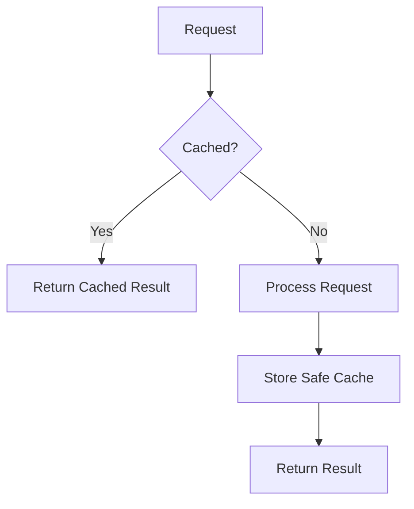

Candidates:

- Parsed documents
- Content hashes
- Web fetches
- Embeddings
- Stable retrieval results
- Generated artifacts where appropriate

Caching must respect user scope and must never allow private content to leak between users.

---

# 35. Asynchronous Processing

Large uploads and web ingestion should not block the user's entire interface.

Example:

```mermaid
flowchart TD
    A["Upload"] --> B["Create Processing Job"]
    B --> C["Queued"]
    C --> D["Parsing"]
    D --> E["Chunking"]
    E --> F["Embedding"]
    F --> G["Indexing"]
    G --> H["Completed"]
```

The frontend can display:

```text
Queued
Processing
Embedding
Indexing
Completed
Failed
```

---

# 36. Observability

Every major pipeline stage should be measurable.

| Stage      | Metrics                                       |
| ---------- | --------------------------------------------- |
| Ingestion  | Processing time, failure rate, duplicate rate |
| Parsing    | Extraction success, processing time           |
| Embedding  | Latency, throughput, storage footprint        |
| Retrieval  | Recall@K, relevance, latency                  |
| Reranking  | Quality delta, latency                        |
| Generation | Latency, token usage, failure rate            |
| Grounding  | Unsupported-answer rate, citation coverage    |
| Web        | Fetch success, latency, extraction quality    |

This makes it possible to improve the system based on evidence instead of intuition.

---

# 37. Evaluation Strategy

EasyLearn V2 should be evaluated as a **system**, not only by looking at the quality of the LLM.

Recommended evaluation process:

1. Create a benchmark set of questions against known documents.
2. Measure whether the correct chunk appears in Top-K.
3. Measure whether the final answer is supported by retrieved evidence.
4. Measure refusal quality when context is insufficient.
5. Compare the three candidate LLMs.
6. Compare candidate embedding models.
7. Measure end-to-end latency.
8. Measure memory/resource usage.
9. Test private/global isolation.
10. Test cross-user access attempts explicitly.

---

# 38. Security & Privacy Strategy

Privacy is an architecture requirement.

The system should:

- Authenticate users.
- Authorize every private-data operation.
- Store owner/scope metadata.
- Apply scope-aware retrieval.
- Prevent private data from entering global retrieval.
- Prevent private document names/content from being exposed to other users.
- Define deletion semantics.
- Avoid unnecessarily logging private content.
- Protect generated outputs that summarize private documents.
- Ensure caches respect user scope.

---

# 39. Suggested API Surface

| Area      | Example Endpoint         | Purpose                   |
| --------- | ------------------------ | ------------------------- |
| Auth      | `POST /auth/login`       | Authenticate user         |
| Knowledge | `POST /knowledge/upload` | Upload and index document |
| Knowledge | `POST /knowledge/url`    | Ingest URL                |
| Knowledge | `GET /knowledge`         | List user knowledge       |
| Knowledge | `DELETE /knowledge/{id}` | Delete source             |
| Chat      | `POST /chat/ask`         | Grounded Q&A              |
| Search    | `POST /web/search`       | Discover online sources   |
| Notes     | `POST /notes/generate`   | Generate notes            |
| Notes     | `GET /notes`             | List saved notes          |
| Export    | `GET /notes/{id}/export` | Download note             |
| Graph     | `POST /graphs/generate`  | Generate Mermaid graph    |

The exact API contract can evolve during implementation.

---

# 40. Complete Ingestion-Time Pipeline

```mermaid
flowchart TD
    A["Authenticate User"] --> B["Validate Source"]
    B --> C["Store Source Metadata"]
    C --> D["Parse Source"]
    D --> E["Normalize Content"]
    E --> F["Detect Structure"]
    F --> G["Chunk Content"]
    G --> H["Attach Metadata"]
    H --> I["Compute Content Hash"]
    I --> J["Generate Embeddings"]
    J --> K["Write to Correct Knowledge Scope"]
    K --> L["Mark Ingestion Complete"]
    L --> M["Show in My Knowledge"]
```

---

# 41. Complete User Query Pipeline

```mermaid
flowchart TD
    A["User"] --> B["Authentication"]
    B --> C["Question"]
    C --> D["Determine Context Sources"]

    D --> E["Private Knowledge"]
    D --> F["Global Knowledge"]
    D --> G["Optional Web Search"]

    E --> H["Retrieval"]
    F --> H
    G --> H

    H --> I["Top-K Candidates"]
    I --> J["Optional Reranker"]
    J --> K["Context Assembly"]
    K --> L{"Enough Evidence?"}

    L -->|"No"| M["I don't have enough context"]
    L -->|"Yes"| N["Generation Prompt"]

    N --> O["LLM Router"]
    O --> P["Selected LLM"]
    P --> Q["Grounding Validation"]
    Q --> R["Answer + Citations"]

    R --> S["Optional Notes"]
    R --> T["Optional Graph"]
```

---

# 42. Failure Handling

The system should fail explicitly rather than silently inventing content.

| Failure                  | Expected Behavior                       |
| ------------------------ | --------------------------------------- |
| Unsupported file         | Validation error                        |
| Parser failure           | Mark source failed                      |
| Web fetch failure        | Report unavailable source               |
| Embedding failure        | Retry / mark failed                     |
| Retrieval insufficient   | Grounded limitation                     |
| LLM failure              | Retry / controlled error                |
| Graph generation failure | Return textual explanation              |
| Export failure           | Preserve note and report export failure |

A failed external source should never be replaced by fabricated content.

---

# 43. Recommended V2 Roadmap

## Phase 2A — Core RAG

Build first:

- Authentication
- PDF/DOCX/TXT/MD ingestion
- Parsing
- Chunking
- Metadata
- Embedding benchmark
- Private knowledge store
- Scope-aware retrieval
- One good-enough LLM
- Citations
- Basic grounding guardrail

Architecture:

```mermaid
flowchart TD
    A["Login"] --> B["Upload Document"]
    B --> C["Parse"]
    C --> D["Chunk"]
    D --> E["Embed"]
    E --> F["Private Store"]

    G["Question"] --> H["Private Retrieval"]
    H --> I["Context"]
    I --> J["Grounding Check"]
    J --> K["LLM"]
    K --> L["Answer + Citation"]
```

---

## Phase 2B — Knowledge Expansion

Add:

- Direct URL ingestion
- Web scraping
- Temporary web search / top-K source retrieval
- Curated Global Knowledge Cache
- Global eligibility / source registry
- Inactivity-based TTL (initially 30 days)
- Global rehydration from web retrieval
- Source management
- Optional source publishing

---

## Phase 2C — Learning Layer

Add:

- Short notes
- Descriptive notes
- Detailed notes
- Saved notes
- Notes dashboard
- Markdown export
- TXT export
- DOCX export

---

## Phase 2D — Visual Layer

Add:

- Mermaid generation
- Diagram validation
- Diagram rendering
- Tables
- Optional Internet image retrieval

---

## Phase 2E — Optimization & Polish

Add:

- Three-model LLM benchmark
- Embedding benchmark refinement
- Reranking
- Caching
- Streaming
- Observability
- Modernized frontend
- Performance optimization

---

# 44. Architecture Decisions

| ID  | Decision                                      | Rationale                                                                                        |
| --- | --------------------------------------------- | ------------------------------------------------------------------------------------------------ |
| D1  | RAG-first architecture                        | Retrieval is the primary knowledge mechanism                                                     |
| D2  | Global + Private persistent scopes            | Provides reusable public knowledge and private user knowledge                                    |
| D2a | Global is a curated, TTL-managed cache        | Prevents permanent accumulation of stale/noisy public content                                    |
| D3  | Private-by-default user sources               | User-selected knowledge should remain private                                                    |
| D3a | One-off web search is temporary by default    | Avoids unnecessary embedding/storage of transient results                                        |
| D4  | No SOTA dependency                            | Reduce cost/resource requirements                                                                |
| D5  | Benchmark embeddings for persistent knowledge | Retrieval quality matters, but embeddings are an indexing mechanism rather than the store itself |
| D6  | Prompt-only grounding is insufficient         | Need actual guardrail stages                                                                     |
| D7  | Preserve three learning levels                | Maintains EasyLearn's original learning model                                                    |
| D8  | Mermaid as diagram IR                         | Structured and renderable visual representation                                                  |
| D9  | Search results temporary by default           | Prevent global-store pollution                                                                   |
| D10 | Modular backend first                         | Avoid premature microservice complexity                                                          |

---

# 45. Final Reference Architecture

```mermaid
flowchart TD
    FE["React Frontend"] --> API["FastAPI API"]

    API --> AUTH["Authentication / Authorization"]
    API --> KM["Knowledge Management"]
    API --> CHAT["Chat / Query"]
    API --> NOTES["Notes"]
    API --> GRAPH["Graph Generator"]

    KM --> DOC["Documents"]
    KM --> URL["User URLs"]
    KM --> WEB["Web Search"]

    DOC --> ING["Ingestion"]
    URL --> ING
    ING --> PARSE["Parsing / Extraction"]
    PARSE --> CHUNK["Structure-aware Chunking"]
    CHUNK --> META["Metadata + Scope"]
    META --> INDEX["Persistent Indexing"]
    INDEX --> PRIVATE["Private Knowledge"]

    WEB --> TEMP["Temporary Web Context"]
    WEB --> CAND["Global Candidate / Source Registry"]
    CAND --> ELIG["Eligibility + Curation"]
    ELIG --> GINDEX["Chunk + Embed"]
    GINDEX --> GLOBAL["Global Knowledge Cache"]

    CHAT --> RET["Scope-aware Retrieval"]
    PRIVATE --> RET
    GLOBAL --> RET
    TEMP --> RET

    RET --> HYBRID["Semantic + Keyword Retrieval"]
    HYBRID --> RERANK["Optional Reranking"]
    RERANK --> CTX["Context Assembly"]
    CTX --> SUFF{"Context Sufficient?"}

    SUFF -->|"No"| REFUSE["Grounded Limitation / Web Retrieval"]
    SUFF -->|"Yes"| ROUTER["LLM Router"]

    ROUTER --> L1["LLM 1"]
    ROUTER --> L2["LLM 2"]
    ROUTER --> L3["LLM 3"]

    L1 --> VALID["Grounding / Citation Validation"]
    L2 --> VALID
    L3 --> VALID
    VALID --> ANSWER["Grounded Answer"]

    ANSWER --> NOTES
    ANSWER --> GRAPH
    NOTES --> EXPORT["MD / TXT / DOCX"]
    GRAPH --> MERMAID["Mermaid Renderer"]

    GLOBAL --> TTL["30-day Inactivity TTL"]
    TTL --> EXPIRE["Expire / Remove"]
    EXPIRE --> WEB
```

# 46. Product Definition

> **EasyLearn V2 is a privacy-aware personal knowledge and learning platform where users can bring their own documents and selected web resources, combine them with a curated and TTL-managed global knowledge cache, retrieve the most relevant evidence, and turn that evidence into grounded explanations, structured notes, and visual learning artifacts.**

The long-term value is not the choice of one LLM or one vector database.

The value is the system's ability to:

```text
Connect
   ↓
the right knowledge
   ↓
to the right learner
   ↓
at the right time
   ↓
with the right explanation
```

while remaining:

- Efficient
- Grounded
- Explainable
- Privacy-aware
- Modular

---

# 47. Decisions Still Requiring Benchmarking

The following choices should remain open until implementation experiments are performed:

- Exact vector database / vector store
- Exact embedding model
- Exact three candidate generation LLMs
- Whether reranking is necessary for the initial release
- Exact chunk size and overlap
- Web search provider
- Web scraping implementation
- Authentication provider
- Object storage provider
- Deployment topology
- Mermaid rendering implementation
- Image search provider
- Image licensing/attribution workflow

These are implementation decisions, not changes to the overall V2 product architecture.

---

# 48. Final Strategy Summary

| Area         | Strategy                                                                                               |
| ------------ | ------------------------------------------------------------------------------------------------------ |
| Product      | Personal knowledge + learning platform                                                                 |
| Knowledge    | Persistent private knowledge + curated TTL-managed global knowledge cache                              |
| Documents    | PDF, DOCX, TXT, MD                                                                                     |
| Web          | Direct URL ingestion + temporary top-K online retrieval + eligibility-based global rehydration         |
| Retrieval    | Scope-aware hybrid retrieval: semantic embeddings + keyword search + optional web retrieval            |
| Reranking    | Optional optimization                                                                                  |
| Generation   | Three good-enough LLMs evaluated for quality/cost/latency                                              |
| Embeddings   | Cheap and efficient model selected through retrieval benchmarks; used for persistent indexed knowledge |
| Grounding    | Context sufficiency + guarded generation + citations                                                   |
| Notes        | Short / Descriptive / Detailed                                                                         |
| Export       | MD / TXT / DOCX                                                                                        |
| Visuals      | Mermaid diagrams + optional image retrieval                                                            |
| Privacy      | Authentication + strict private/global isolation                                                       |
| Performance  | Precomputed embeddings, caching, async ingestion, streaming                                            |
| Frontend     | Modern, slick, user-friendly                                                                           |
| Dashboards   | My Knowledge + My Notes                                                                                |
| Architecture | Modular backend / modular monolith initially                                                           |

---

# 49. Global Knowledge Lifecycle

The Global Store follows a simple lifecycle:

```text
Discover public source
        ↓
Eligibility / curation
        ↓
Global Knowledge Cache
        ↓
Used in retrieval? ── Yes → refresh source last_accessed_at / TTL
        │
        No
        ↓
30 days inactive
        ↓
Expire / remove from persistent index
        ↓
If requested again → web retrieval → eligibility → rehydrate
```

This keeps the global retrieval layer small, relevant, and demand-driven.

---

# 50. One-line V2 Philosophy

> **Retrieve the knowledge, verify the context, then let the LLM teach.**
