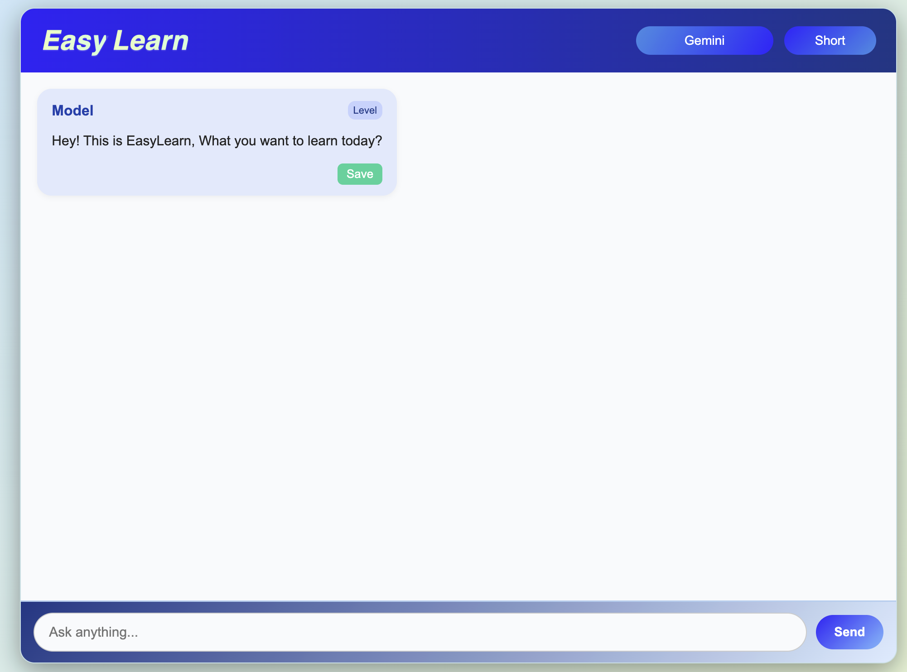
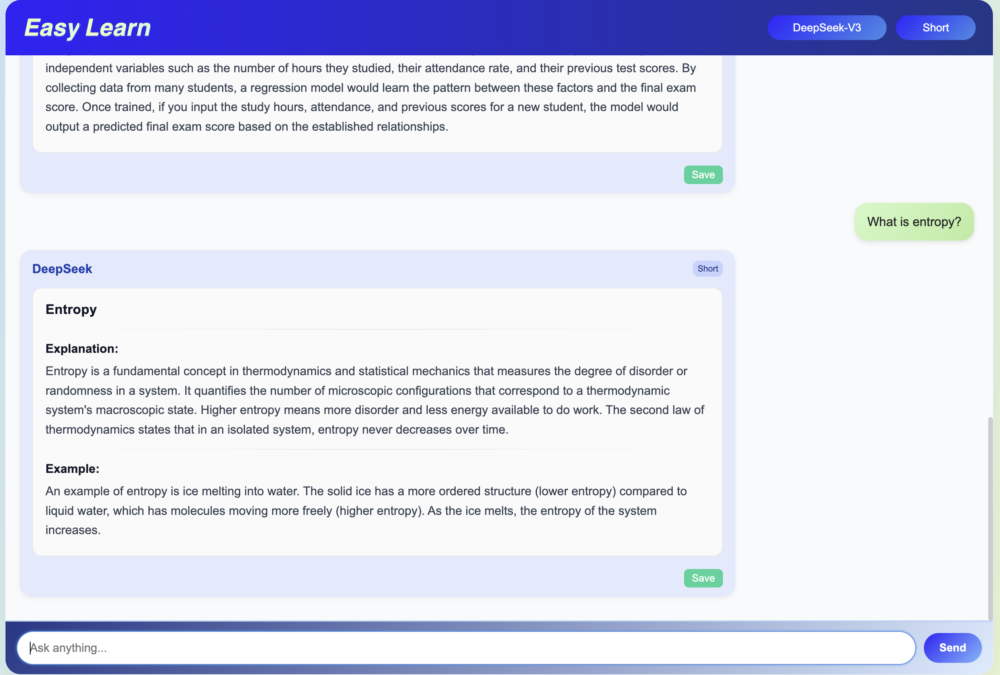
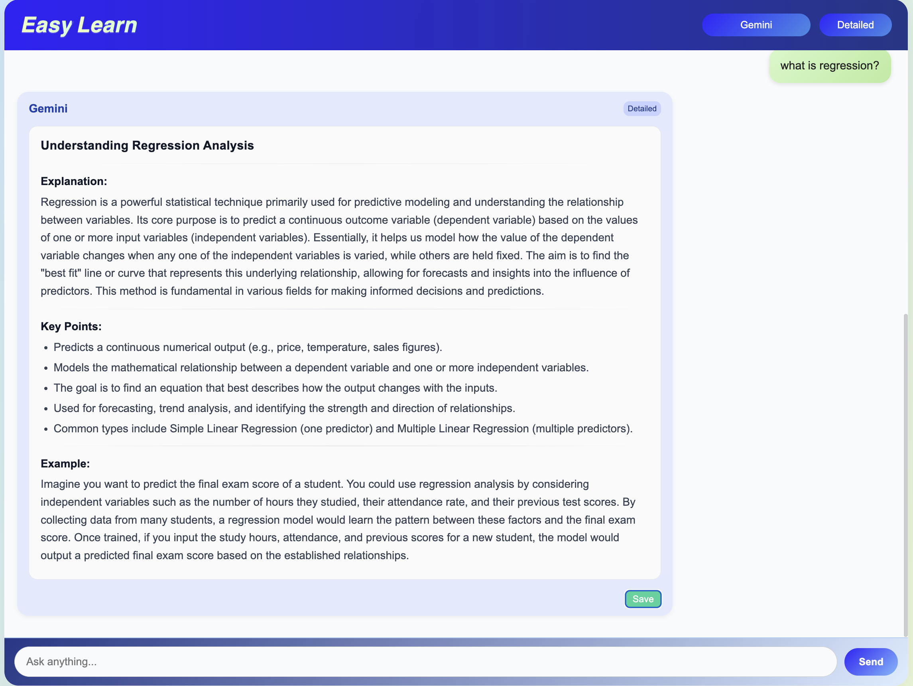
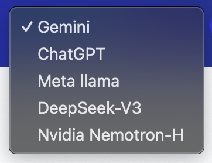

# EasyLearn

## **EasyLearn** is an **LLM-based chatbot** designed to help learners understand topics at different depths of understanding through structured and adaptive explanations.

## Project Idea

The chatbot allows a learner to enter a topic of their choice.  
Our **LLM (Large Language Model)** then generates study notes at three levels:

1. **Short** – Simplified notes for quick understanding.
2. **Descriptive** – Step-by-step reasoning for better clarity.
3. **Detailed** – In-depth content for advanced learners.

## Tech Stack

- **Backend**: Python, LangChain, FastAPI, Pydantic, Uvicorn
- **Frontend**: ReactJS, HTML, CSS, JavaScript
- _Can add or change technologies according to project requirements._

## UI Previews

### Home Page

### Example Outputs

### Available Models

## Goal

To make learning **personalized and adaptive**, catering to beginners, intermediates, and advanced learners, all in one platform.

---

_Currently under development._
